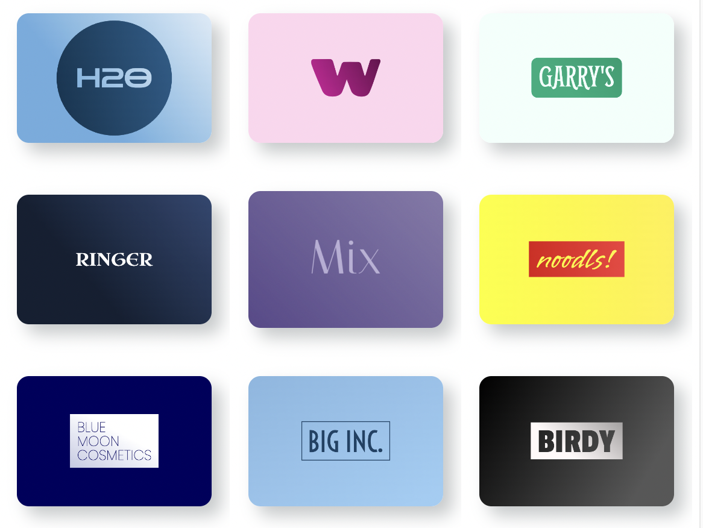
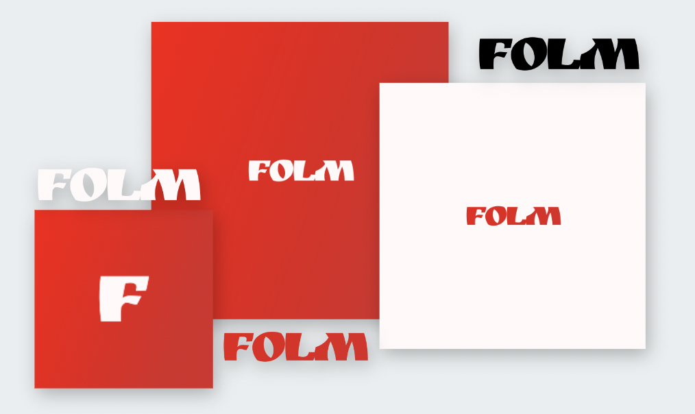

# Logokio - Generate wordmark logos in your browser

Using Google Fonts API and Javascript Canvas, Logokio helps you generate logos for your websites or apps. 

There is no server involved, the code completely runs in your browser.

## Features

- **No Registration:** You can start creating logos right away, no need to sign up or log in.

- **Browser-Based:** Logokio works directly in your web browser, making it accessible from anywhere.

- **Unlimited Design Options:** Explore a variety of logo templates and customize them to suit your brand.

- **High-Quality Downloads:** Download logos in high-quality formats for use on your website, social media, and more.

## How to Use
1. Make sure you are using the latest Chrome/Firefox or Safari browser.
2. Open [Logokio](https://logokio.com) and enter your logo text in the input field.
3. Click the "Make a Logo" button to generate your logo.
4. Explore multiple logo options and choose the one that you like.

## Showcase

## Multiple Logo Files

With just one click, you get various logo file options, including:

- Colored background logo in PNG format
- Inverted logo
- Black transparent logo
- White transparent logo
- Transparent colored logo
- SVG file

## To-Do
- A single ZIP file download of all logo files.

## Contributions

This project is created and maintained by [@avadhesh18](https://github.com/avadhesh18). You are welcome to contribute by submitting issues or pull requests to improve the logo generator.

## License
GNU General Public License (GPL) 3.0

